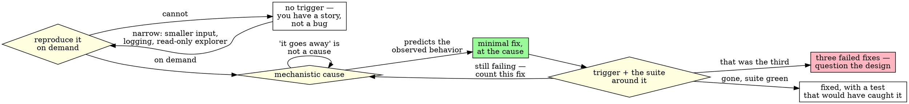

# Systematic Debugging

## Overview

**A fix you cannot explain is a guess wearing a diff.** Until the failure
happens on demand and you can say *mechanistically* why, any change you make is
as likely to hide the bug as to remove it. Follow the spirit, not the letter:
running the reproduction once, seeing red, and then fixing what you *assumed*
was wrong satisfies the ordering and proves nothing. The rule is that the cause
you fix is the cause you demonstrated.

**Write for the agent who inherits this: the next phase agent is you, with your
context gone.** They will not have your hunch, your scrollback, or the shape you
recognized. They get the reproduction command, the cause you wrote down, and the
test you added — anything you only knew is lost at the phase boundary.

## The Iron Law

```
NO FIX BEFORE A REPRODUCTION AND A MECHANISTIC CAUSE.
```

No exceptions:

- **Do not act on a shape you recognize.** A failure matching one you have seen
  before is a reason to *suspect* a cause, not a reason to skip confirming it.
  Go read this instance's fixture, input, or state and confirm it is that bug.
  Recognition works on the assertion output; the bug lives somewhere you have
  not looked yet.
- **Do not read a conditional instruction as permission to skip its condition.**
  *"If it's the off-by-one, just fix it"* waives re-litigating the fix once the
  cause is confirmed — it never waives confirming it. Establish the antecedent
  yourself, then take the permission it grants.
- **Do not let a deadline shorten the verification.** After the fix, re-run the
  original trigger **and** the broader suite around it. The clock does not
  change which tests can catch what this fix disturbed. If you truly cannot run
  them, name the ones you did not run and do not report the bug as fixed.
- **Do not attempt fix #4.** Three fixes that did not work means your model of
  the system is wrong, not that the fourth guess is due. Stop, say so, and
  question the design with whoever owns it before changing another line.
- **Do not substitute reasoning for a reproduction.** If you cannot trigger the
  failure on demand, that is the finding to report. Keep narrowing — smaller
  input, more logging, a read-only explorer — and stop before shipping a fix
  you cannot verify.

## Announce

Say this out loud when you start, before the first edit:

```
Using drovr:systematic-debugging — reproducing before fixing.
```

## The procedure

> When a skill or briefing gives you a numbered checklist, create **one tracked item per step**
> using whatever task tool this harness exposes — `TodoWrite`, or `TaskCreate`/`TaskUpdate` —
> before you start step 1. Mark each in-progress when you start it and complete when its
> evidence is in hand. If the harness exposes no task tool, write the checklist to
> `~/.local/share/drovr/runs/<run>/checklist.md` when inside a run, or `CHECKLIST.md` at the
> repo root otherwise, and tick items there. An untracked checklist decays with the context
> window; that decay is the exact failure drovr exists to fight.

Re-create those items for each bug you work, not once for the session. If you
fall back to `CHECKLIST.md` at a repo root, do not commit it.

1. **Reproduce.** Get a reliable, minimal trigger and record the exact command
   and its output. A bug you cannot reproduce on demand is a bug you cannot
   prove you fixed.
2. **Isolate.** Narrow to the smallest input, file, or code path that still
   shows it. Bisect, add logging, or dispatch a **read-only explorer** to map
   the suspect area. Fan-out investigation belongs to read-only explorers (e.g.
   `explore-mcp`), never to parallel writers — you keep the editing, which is
   what keeps drovr's single-writer rule intact.
3. **Root-cause.** Explain *why* it happens, mechanistically. "Adding this line
   makes it go away" is not a cause. Keep going until the explanation predicts
   the observed behavior exactly — including the parts you were not chasing.
4. **Fix.** Make the minimal change that addresses the cause, not the symptom.
5. **Verify.** Re-run your original trigger and confirm it is gone, then run the
   suite around it — unconditionally, whatever the clock says. Add or fix a test
   that would have caught it.
6. **Escalate at three.** Keep a count of fixes you have made that did not
   remove the failure. At three, stop and question the design with whoever owns
   it. Do not attempt fix #4 without that conversation — a run of wrong guesses
   is evidence about your model, not about the next guess.

### The cycle



## Red flags — STOP

Some of these are thoughts and some are things you have just observed. Either
way you are at the line, not past it — stop here and the loop is still intact.

- *"We've seen this before."* · *"It's the same bug as last month."* · *"If it's
  X, just fix it."* · *"I'll run the broader suite if there's time."* — each of
  these has a row in *Rationalizations* below. Go do the thing in its row.
- *You are editing code and have not yet run the failing command yourself.* →
  Run it first. What you are fixing is a description of the bug, not the bug.
- *The failure went away and you cannot say why.* → Put the change back and
  confirm it returns. A fix whose mechanism you cannot state may be moving the
  bug rather than removing it.
- *The failure is intermittent, so you will "fix it and watch".* → You have no
  trigger, so you will have no proof. Narrow until it is on demand, or report
  that you could not.
- *You are about to make your fourth attempt at the same failure.* → Stop.
  That is the escalation trigger, not a streak to break.
- **Any thought that ends with an edit landing before you can state the cause in
  one sentence.** The reason does not matter and the quality of the reasoning
  does not matter — if you are explaining why the cause can wait, that is the
  red flag.

## Rationalizations

The right-hand column is an instruction, not an argument. Do the thing in it.

| The thought | Do this instead |
|---|---|
| *"We've seen this exact failure before — it's the day-boundary off-by-one."* | Read this instance before you touch it. A prior bug of the same shape is a hypothesis to check, and checking it costs a few minutes, not the afternoon you are protecting. |
| *"They said if it's the off-by-one, just fix it."* | Confirm the antecedent, then take the permission. The conditional waives re-litigating the fix once you have the cause; it does not waive getting the cause. |
| *"The fix works — I don't need to explain why the bug happened."* | State the mechanism now, in one sentence, before you move on. If you cannot, you have a change that correlates with green, and the next agent inherits nothing they can reason from. |
| *"I can't reproduce it, so I'll fix it and see."* | Report that you cannot reproduce it and keep narrowing. Shipping a fix for a failure you never triggered spends someone else's next debugging session on your guess. |
| *"I'll run the broader suite if time allows."* | Run it before you report. The deadline changes what you can finish; it does not change which tests can catch what this fix disturbed. Cut scope somewhere it is visible instead. |
| *"Three attempts in — the next one will land."* | Stop at three and question the design. Three wrong fixes is a measurement of your model of the system, and the fourth guess is drawn from the same wrong model. |
| *"Adding logging would take longer than just trying the fix."* | Add the logging. "Just trying it" is one attempt per compile with no residue; instrumentation is what makes the next attempt cheaper and the cause visible. |

## Worked example

❌ **What this looks like when it fails:**

> Re-run `report::tests::totals_by_day` alone first to confirm the specific fix,
> then, if time allows before 16:00, run the broader `report` test module too.

✅ **What it looks like when it holds:**

> Using drovr:systematic-debugging — reproducing before fixing. Trigger:
> `cargo test report::tests::totals_by_day`, red on every run. Cause, read out
> of the fixture: entries after 23:00 are bucketed by UTC date while the totals
> are summed by local date, so each day's last hour lands in the next day —
> which predicts the exact off-by-one in the assertion. Minimal fix: bucket by
> the calendar the totals use. Re-running the one test — green — and the whole
> `report` module now, before I report anything. The 16:00 deadline does not
> decide which tests can catch what this fix disturbed.

## Cross-refs

- `drovr:tdd` — REQUIRED once the reproduction can be written as a test. Write
  it, watch it fail, then fix: that red run is both your trigger and your proof.
- `drovr:verification-before-completion` — REQUIRED before you call the bug
  fixed. The reproduction going green is necessary, not sufficient.
- `drovr:code-review` — REQUIRED once the fix is green, before you call the
  change done.
- `drovr:handoff` — REQUIRED at a phase boundary. Record the trigger and the
  mechanism there; they are the parts of this that do not survive in the diff.
