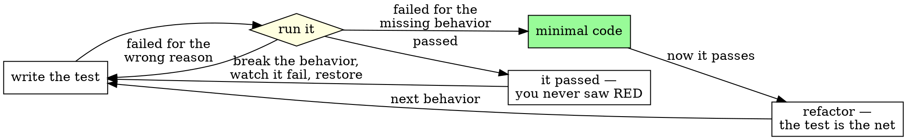

# TDD

## Overview

**A test that has never failed is not evidence.** It may pass for the wrong
reason, cover a path your change never touches, or not have run at all — and a
green result cannot tell you which. Watching it go red is what proves it is
wired to the behavior you care about. Follow the spirit, not the letter: a test
written first, run once, and green on the first run satisfies the *ordering* and
proves nothing. The rule is the red run, not the order you typed things in.

**Write for the agent who inherits this: the next phase agent is you, with your
context gone.** Your tests are the only account of this code that *re-runs* —
the handoff and the git log describe what you did, but only a test can be
executed by whoever comes next.

## The Iron Law

```
NO IMPLEMENTATION CODE BEFORE A TEST YOU HAVE WATCHED FAIL.
```

No exceptions:

- **Do not keep the working code where you can read it.** Get it out of your
  working set without losing it — commit it on a scratch branch, or
  `git stash push -m "spike: <behavior>"` — and do not open it, diff it, or
  scroll back to it until the test is green. A test drafted beside the code
  describes what the code does, which is the one thing you already know.
- **Do not write an obvious test afterwards.** Write it first. An obvious test
  takes a minute and is the only *repeatable* thing that proves the new behavior
  is reachable; written afterwards it proves the code compiles.
- **Do not exempt a refactor.** A refactor changes no behavior, so it adds no
  code the Iron Law governs — but it still needs the net: run the covering test
  and watch it **pass** before you touch anything. If nothing covers the
  behavior, this is not a refactor and you have no net. Write the test and watch
  it fail against the gap first.
- **Do not let "hard to run" become "not run".** If you cannot run the single
  test, run the whole suite and read the one result. If it genuinely cannot be
  run here, stop before writing implementation code and surface it as a blocker
  in your report — name what you could not run and why. Do not substitute
  reasoning for a result you never saw, and do not report the behavior as
  working.

## Announce

Say this out loud when you start, before the first edit:

```
Using drovr:tdd — writing the failing test before the implementation.
```

## The procedure

> When a skill or briefing gives you a numbered checklist, create **one tracked item per step**
> using whatever task tool this harness exposes — `TodoWrite`, or `TaskCreate`/`TaskUpdate` —
> before you start step 1. Mark each in-progress when you start it and complete when its
> evidence is in hand. If the harness exposes no task tool, write the checklist to
> `~/.local/share/drovr/runs/<run>/checklist.md` when inside a run, or `CHECKLIST.md` at the
> repo root otherwise, and tick items there. An untracked checklist decays with the context
> window; that decay is the exact failure drovr exists to fight.

Re-create those items for each behavior you cycle through, not once for the
whole task. If you fall back to `CHECKLIST.md` at a repo root, do not commit it.

1. **Name the test.** Use the one the task's verification names, if it names
   one. Scope it to the interfaces this task actually changes — a wider test
   stops being a contract the next phase can rely on.
2. **Clear the workspace.** *Uncommitted code you wrote for this task* that
   already implements the behavior gets parked, unread, until step 6. Committed
   code stays where it is: you are adding a test that fails against today's
   behavior, not emptying the repo. If parking a fragment breaks the build, park
   the whole change instead.
3. **Write the test** against the requirement as stated, not against anything
   you have already built.
4. **Run it and watch it fail.** Confirm the failure is attributable to the
   behavior you are adding — a compile or import error naming the symbol you
   have not written yet counts, and is the normal first RED in a typed language.
   A typo in the test, a fixture that never loaded, or a suite that never
   selected your test does not: that is a broken test, not a red one.
5. **Write the minimal code that turns it green.** No speculative structure, no
   extra cases.
6. **Run it again and watch it pass.** Only now may you open whatever you parked
   in step 2, and only to salvage from it.
7. **Refactor with the test as the net**, re-running it after each step.

Repeat per behavior. One failing test at a time.

### The cycle



## Red flags — STOP

Some of these are thoughts and some are things you have just observed. Either
way you are at the line, not past it — stop here and the cycle is still intact.

- *"I already validated it by hand."* · *"I'll add the test in a follow-up."* ·
  *"The logic is right, just land it."* · *"This is just a refactor."* — each of
  these has a row in *Rationalizations* below. Go do the thing in its row.
- *The test passed the first time you ran it.* → You never saw RED, so you have
  no evidence. Break the behavior deliberately, watch the test fail, restore it.
- *The test covers more than the interfaces this task changes.* → Tighten it.
  Drift breaks the contract the next phase inherits.
- *The failure is not the one you predicted.* → Do not repair it by guessing.
  Switch to `drovr:systematic-debugging` and find the cause first.
- **Any thought that ends with code landing before a failing test has run.**
  The reason does not matter and the quality of the reasoning does not matter —
  if you are explaining why RED is optional this time, that is the red flag.

## Rationalizations

The right-hand column is an instruction, not an argument. Do the thing in it.

| The thought | Do this instead |
|---|---|
| *"I already validated the behavior by hand and don't want to redo that work."* | Redo it as a test. The hand check is unrepeatable and invisible; the work you are protecting is the work that has to survive. |
| *"Set it aside — stash it rather than delete it, I don't want to lose it."* | Park it, and do not open it again until step 6. Reading it while you draft the test is what makes the test describe the code instead of the requirement. |
| *"Add the test in a follow-up."* | Write it now. Once the code has landed and the pressure is off, the follow-up is written to match what the code already does — it checks the implementation, not the requirement. |
| *"The logic's right, just land it."* | Cite the named test back and write it. Correctness review and verification are different claims; neither one waives the other. |
| *"The test is obvious, so I'll write it after."* | Write it first, in the minute it takes. An obvious test written after the code has never told anyone anything they did not already assume. |
| *"It's a refactor, so this doesn't apply."* | Run the covering test and watch it pass before you start. If none covers it, write one first — a change with no test is a rewrite, whatever you call it. |
| *"The harness makes it hard to run one test."* | Run the whole suite and read your one line of it. If you truly cannot run it, report that you could not, and do not claim the behavior works. |
| *"There isn't time in this session for the full cycle."* | Write the RED test for the one behavior you can finish, and put the rest in your handoff as unstarted. Untested code landed to make a deadline is a defect with a deadline attached. |

## Worked example

❌ **What this looks like when it fails:**

> The spike in `cmd/report/main.go` already produces the right output and I
> checked it by hand, so I'll land it now and add `TestReportSinceFilter` in a
> follow-up.

✅ **What it looks like when it holds:**

> Using drovr:tdd — writing the failing test before the implementation. Per the
> Iron Law's first bullet I'm stashing the spike unread, not deleting it.
> Writing `TestReportSinceFilter` against the requirement: entries before
> `--since` are excluded. Running it — FAIL, the filter is never applied. Now
> the minimal code.

## Cross-refs

- `drovr:systematic-debugging` — REQUIRED when a test fails for a reason you did
  not predict. Do not repair it by guessing.
- `drovr:code-review` — REQUIRED once the test is green, before you call the
  change done.
- `drovr:verification-before-completion` — REQUIRED last, after review has come
  back. One green test is necessary, not sufficient.
- `drovr:handoff` — REQUIRED at a phase boundary. The tests you wrote are the
  contract the next phase inherits; record them there.
