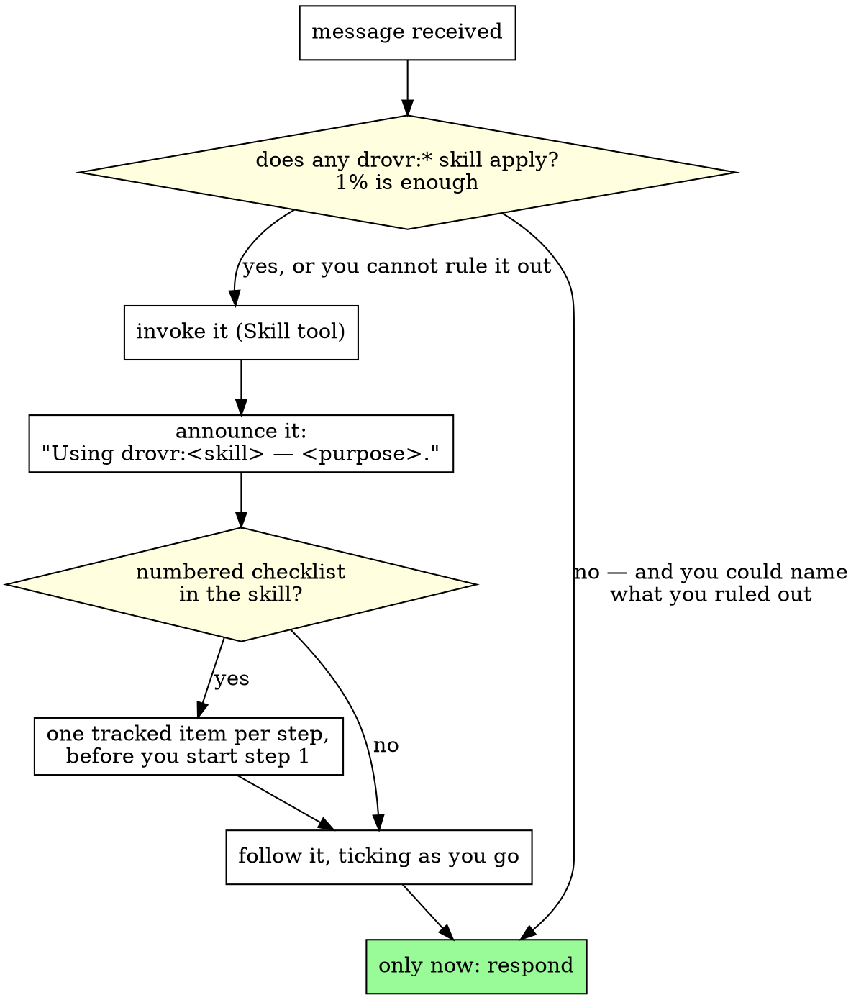

**The 1% rule.** If there is even a 1% chance a drovr:* skill applies to what you
are about to do, invoke it. You do not have to be sure: if it turns out not to fit,
say so in a line and drop it, because invoking costs almost nothing. Skipping one
costs the discipline, silently.

**Every turn, not only the first** — before *any* response, including clarifying
questions and read-only exploration. Reading a file to decide what to do is already
doing the task, and mid-task is where this gets skipped.

# Using Drovr

<SUBAGENT-STOP>
If you were dispatched as a subagent to execute a specific task, ignore this
reflex — it is for the human-facing agent, not for you. Do your task.
</SUBAGENT-STOP>

## What this is

This is your **always-on router**. Drovr is a working **discipline**, not just an
orchestration engine, and it is your default operating mode. This skill does not
do the work — it tells you *how* to work and *when* a task has outgrown one
context and must become its own phase.

Drovr exists because model output degrades as a context window fills (Chroma's
*context rot*, trychroma.com/research/context-rot). A fresh, tight context beats
a long one. Everything below serves that.

## Instruction priority — the human outranks this file

1. **The human's explicit instructions** — what they tell you directly, and what
   `CLAUDE.md` / `AGENTS.md` say on their behalf. Highest.
2. **drovr skills** — these outrank your defaults wherever the two disagree.
3. **Your own default behaviour** — lowest.

**Not optional.** Every MUST in drovr is aimed at your own defaults, never at the
person you are working with. If they tell you to skip a skill, skip it: say once,
plainly, that you are setting it aside because they asked, and get on with their
work. The 1% rule above is written hard enough to talk over a human; this ladder is
what sits under it.

## The gate

The *no* edge is real — the test is whether you could name what you ruled out.
"Nothing came to mind" is not ruling out.

**The checklist branch binds, and this is the whole of it:**

> When a skill or briefing gives you a numbered checklist, create **one tracked item per step**
> using whatever task tool this harness exposes — `TodoWrite`, or `TaskCreate`/`TaskUpdate` —
> before you start step 1. Mark each in-progress when you start it and complete when its
> evidence is in hand. If the harness exposes no task tool, write the checklist to
> `~/.local/share/drovr/runs/<run>/checklist.md` when inside a run, or `CHECKLIST.md` at the
> repo root otherwise, and tick items there. An untracked checklist decays with the context
> window; that decay is the exact failure drovr exists to fight.

## Red flags — you are about to route nothing

Drovr's failure mode is invoking no skill at all and never noticing — nothing goes
wrong at the moment you skip. Catch these before you answer.

| You are thinking | What it is, and what to do |
|---|---|
| *"I already know the shape of it."* · *"I'm fairly sure how this works."* | Familiarity is the trigger, not the exemption — a hunch from an earlier read is not knowing. Invoke the skill that governs finding out. |
| *"I'll just do it quietly, as the first step of the fix."* | You have already decided a methodology applies. Doing it silently drops the invocation, the announcement and the tracked checklist — the three things that make it hold under pressure. Invoke it. |
| *"Announcing which methodology I am following would read as process theatre."* | Announce it in the working record — this session — not the customer-facing thread. That distinction answers the objection; it is not a reason to skip. One sentence, not a speech. |
| *"That is my call to make, not theirs."* · *"Asking just burns clock."* | That settles *who answers*, not *whether a skill applies*. Run the gate before you ask a clarifying question, and before you decide not to ask one. |

## The principle (always)

<!-- reflex:section:single-writer -->
**Single writer, read-only explorers.** One agent edits at a time. Fan-out
investigation goes to read-only explorers (e.g. `explore-mcp`), never to parallel
writers. This holds whether you stay inline or escalate to phases.
<!-- /reflex:section:single-writer -->

<!-- reflex:section:always-review -->
**Always review.** Any change you write gets reviewed before you call it done —
invoke **`drovr:code-review`** (read-only review subagents; they find, you fix).
This is not optional and not gated on the change's size; it runs whether you
worked inline or across phases.
<!-- /reflex:section:always-review -->

<!-- reflex:section:methodology -->
## For the task in front of you, apply the right methodology skill

Pick by what you are doing — invoke it via the `Skill` tool before you act:

- Implementing a feature or bugfix → **`drovr:tdd`** (test-first, watch it fail).
- Chasing a bug, test failure, or unexpected behavior → **`drovr:systematic-debugging`**.
- About to claim something is done/fixed/passing → **`drovr:verification-before-completion`**.
- Reviewing an artifact (code, spec, plan) → **`drovr:code-review`**. Per the
  *Always review* rule above, this runs on every change — not only before shipping.
<!-- /reflex:section:methodology -->

<!-- reflex:section:escalation -->
## Escalation contract — inline first

**Default: do the work inline in this session.** Do not reach for phases for a
task that fits. Escalate only when a single context cannot hold the work well.

- **Primary signal — context fullness.** If the transcript is filling to the
  point where output would rot, escalate.
- **Secondary heuristic** (a proxy for the above, not a hard rule): roughly
  **10+ files** touched, or **3+ independent work items**.

When you must escalate, pick the smallest tool that fits:

- **Mid-flight escape hatch — author a HANDOFF yourself.** You are deep in a task
  and this context is filling. You have the whole session in context, so compress
  it *yourself*: write a `HANDOFF.md` (the 7-section shape from `drovr:handoff`,
  git pointers included), then continue in a fresh agent seeded from it. Nothing
  compresses it for you — the finishing agent always authors its own handoff.
- **A single planned boundary → `drovr:handoff`.** Hand finished work across one
  phase boundary to a fresh clean-context agent.
- **A full gated run → `drovr:pipeline`.** Brainstorm → plan → implement → review
  with a human approval gate on `spec.md` before any code is written.

**Putting *any* spec/design in front of a human for approval — even a one-off, not a
full pipeline — goes through the review gate, and the gate has two halves you must run
together:** `drovr review summary <run> "<what changed>"` to present `spec.md`, **and** a
backgrounded `drovr review wait <run>` — the *watch*. (The server itself is global and
always-on: `drovr serve` takes **no** run argument and auto-starts on demand, so serving is not
a step you perform per run.) `summary` opens the gate and prints the reviewer's page URL plus
the exact watch command; it does **not** start the watch. Without the watch you never learn the
decision and fall back to hand-polling `GET /state` (the anti-pattern).
`review wait` blocks on the gate and the harness wakes you when the reviewer acts
(exit `0` approved · `3` request-changes + `feedback.json` · `5` cancelled — the human
abandoned the run, stop · `2` timeout, re-run · `1` error, which is **never** an approval).
Revise loop: edit `spec.md` →
`drovr review summary <run> "<what changed>"` → re-background `review wait`. Full mechanics
(state machine, diff baselining, gotchas) live in `drovr:pipeline` → "The spec gate".

**REQUIRED BACKGROUND:** the downstream skills assume this file's contracts —
single-writer rule, the run dir at `~/.local/share/drovr/runs/<name>/`, and that
`drovr phase start` spawns a plain `claude` and does **not** inject the seed
(injecting the briefing is the skill's job, via `drovr phase send`).
<!-- /reflex:section:escalation -->
