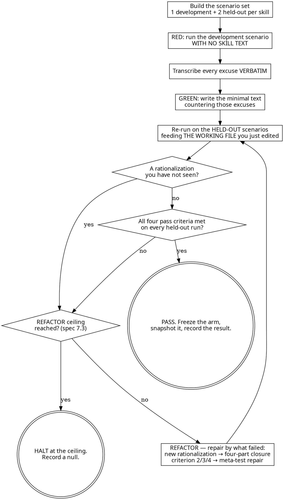

# Writing Skills

## Overview

A skill is not documentation. It is a prompt that must survive two things
documentation never faces: a context window filling around it, and a reader with
a reason to want it not to apply. Text that reads clearly in a fresh session is
evidence of neither.

So skills are written the way code is written here: **test first**.

**Following the letter is the whole point.** A skill you honoured "in spirit" by
doing something else is a skill that did not bind. If a rule is wrong, change the
rule and record why — do not route around it in the moment.

## The mapping [tier 3]

Ported from superpowers' convention in drovr's own terms: a convention-follow,
not an evidence-backed choice.

| Testing a skill | The TDD it is |
|---|---|
| Pressure scenario | The test case |
| `SKILL.md` | The production code |
| **RED** | The agent violates the rule *without* the skill |
| **GREEN** | The agent complies *with* it |
| **REFACTOR** | Each new loophole is closed |

**If you never watched an agent fail without the skill, you do not know which
failures it prevents** — only which ones you imagined, and those buy the wrong
text at full price in context.

Not every skill needs this — `references/testing-with-subagents.md` says which
ones do.

## The loop [tier 3]

**You leave the loop two ways, whichever comes first.**

- **PASS takes both halves**: no rationalization you have not already countered,
  **and** all four pass criteria on every held-out run. Running out of excuses
  you can think of is not clearing a bar.
- **HALT at the REFACTOR ceiling** (`spec.md` §7.3). "Repeat until it is clean"
  with no bound is the unbounded-cost defect drovr exists to prevent everywhere
  else. Hitting it is a result: record the null and stop.

**REFACTOR takes two kinds of input, and they get different repairs.** A run can
produce both; apply each that fits.

- **A rationalization you have not countered** → the **four-part closure** below.
  It needs the agent's own words, and you have them.
- **A criterion failed with no rationalization** — complied but cited no section,
  named no temptation, or the meta-test asked for a change → the repair table in
  `references/testing-with-subagents.md`, which pairs each failure with its fix.

There is no third case. **Never stretch the four-part closure over a failure with
no quote**: a table row invented to fill the template counters an excuse no agent
made — a fabricated observation (§2.1 exception 1).

Author counter-text from the **development** scenario only.

**Which text you paste changes as you go, and getting it wrong invalidates the
run.** RED pastes none; every re-test in this loop pastes **the working file you
are editing**; only a *frozen arm* comes from `docs/skill-evidence/arms/`. Read
the per-step rule in `references/testing-with-subagents.md` before you dispatch.

## The four-part closure [tier 3]

Each new rationalization gets **all four of these, every time — never one**. One
by itself leaves the same excuse reachable by a slightly different route, and
the agent that finds the route is you, later, under pressure.

1. **Negate it inside the rule.** Name the specific move in the rule's own text,
   paired with what to do instead.
2. **Add a row to the rationalization table.** Thought on the left; on the right
   an *instruction*, not a rebuttal — "run the command", not "that is unproven".
3. **Add a red-flag bullet.** Quote the inner monologue as the agent would think
   it, so it is recognisable from the inside.
4. **Update `description:`** to add the *symptom of being about to violate* —
   not a summary of the skill. The description is the line that decides whether
   the skill is loaded at all, so it must name the moment, not the topic.

## Pass criteria [tier 3]

All four, on the held-out scenarios:

1. The agent picks the correct option **under maximum pressure**.
2. It **cites a specific section** of the skill.
3. It **names the temptation** and complies anyway.
4. The meta-test comes back clear: asked "how should this have been written so
   the right answer was unmistakable?", the agent answers that it already was.

**Not bulletproof if** any of these appear:

- a rationalization you have not countered,
- the agent arguing the skill itself is wrong,
- an invented hybrid that claims to satisfy both options,
- the agent asking permission while arguing hard for the violation.

The fourth is easy to score as compliance by mistake: asking is not complying
when the ask is a brief for the other side.

## Rules that hold while you do this

- **Probe subagents run in the FOREGROUND.** Never `run_in_background`, never a
  scheduled wake-up. Backgrounding a probe stalls the run with nobody told.
- **You are the single writer.** Subagents run scenarios and score them; they do
  not edit skills.
- **No fabricated measurements** (`spec.md` §2.1 exception 1). No number, rate,
  duration or comparative unless `docs/skill-evidence/` holds it or a citation
  supports it. "Every time" is emphasis and fine; "in 94% of runs" is not.

All three in full, with the transcript protocol: `references/testing-with-subagents.md`.

## Red flags — STOP

- "I know what agents get this wrong on" → that is a hypothesis, not a RED run.
  Run the baseline and write down what came back.
- "The scenario is unrealistic" → make it harder, do not soften the bar.
- "It only failed once, that is noise" → transcribe it anyway.
- "I will add the rationalization table at the end" → add all four parts now,
  for the excuse in front of you, before you run anything else.
- "The held-out scenario is basically the same, I will peek" → close it. If you
  already read it, say so and write a replacement.

## Rationalizations

| The thought | What to do instead |
|---|---|
| "I already know the failure mode, I can skip the baseline" | Run it. The excuse an agent reaches for need not be the one you predicted, and the text has to counter the real one. |
| "The agent complied, so the skill works" | Check it complied on a **held-out** scenario, with all four pass criteria. Compliance on the scenario you wrote against is the test grading itself. |
| "One more paragraph cannot hurt" / "longer must be stickier" | Add the four-part closure for an excuse you observed, and nothing else. Every paragraph costs context in every session that loads the skill, and this repo is measuring that assumption rather than paying it. |
| "I will just re-run until it passes" | Stop at the ceiling and write the null down. A null is a result; an untracked loop is not. |
| "I can score my own rewrite" | Hand it to a separate read-only scorer subagent working from `references/scoring-rubric.md`, blind to the arm label. |

## References

Load these when you reach the step that needs them.

- `references/pressure-scenarios.md` — building a scenario that applies real
  pressure, and the frontmatter every scenario file carries.
- `references/testing-with-subagents.md` — running the probes: which text to
  paste, foreground, transcripts, the meta-test and its repairs.
- `references/scoring-rubric.md` — the rubric, verdict object and blinding.
  This is the file the scorer is handed.

REQUIRED BACKGROUND: `drovr:tdd` defines the cycle this skill applies to prose.
`drovr:verification-before-completion` governs the claim that a skill passed.

Anthropic's skill-authoring guidance prescribes the same shape independently —
build the evaluations first, take a baseline without the skill, write minimal
instructions, iterate. Cited as convergent design advice, not as a measurement
drovr has run:
https://platform.claude.com/docs/en/agents-and-tools/agent-skills/best-practices
